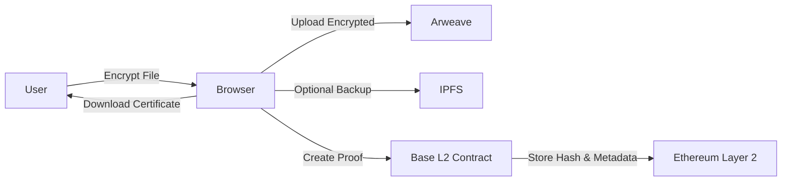

# Aeternum — Permanent, Private, Verifiable Evidence Vault

**Permanent. Private. Verifiable.**

Aeternum is a **zero-knowledge, blockchain-timestamped evidence vault** that lets you store and prove ownership of files forever. Files are **encrypted client-side**, stored on **permanent decentralized storage** (Arweave, optional IPFS), and cryptographic proofs are recorded on **Base** so evidence is **immutable and verifiable**. Ownership is proven via **Groth16 ZK proofs** — the secret never appears on-chain.

---

## Overview

**Use cases**

- Legal evidence & whistleblower files  
- Copyright and content proof  
- Sensitive personal or organizational documents  
- Journalism and activism media  

Aeternum keeps your **data private, tamper-proof, and permanently accessible**.

---

## Key Features

| Area | Description |
|------|-------------|
| **Privacy-first** | Client-side AES-256 encryption, zero-knowledge architecture. You keep full control of decryption keys; no raw files or secrets on servers. |
| **Permanent storage** | Primary on **Arweave**; optional **IPFS/Pinata** backup. One-time upload for long-term availability. |
| **Verifiable proofs** | On-chain hash + ZK commitment on **Base (Ethereum L2)**. Groth16 proofs prove ownership without revealing the secret. Downloadable **evidence certificate** (timestamp, file hash, storage reference). |
| **Anonymous backend** | Optional Supabase for anonymous logs, rate-limiting, status tracking. Wallet-only auth; no storage of secrets or raw files. |
| **Developer-friendly** | UUPS upgradeable contracts, gas-optimized Solidity, modular and audit-ready design. |

---

## Architecture

### High-level flow



### System architecture (on-chain + ZK)

```
┌──────────────────────────────────────────────────────────────────────┐
│                        OFF-CHAIN (Client)                             │
│                                                                       │
│  File ──keccak256──► fileHash                                         │
│  fileHash + secret ──Poseidon──► commitment   (stored on-chain)       │
│  fileHash + secret ──Groth16──► zkProof       (sent to verifyOwnership)│
│                                                                       │
│  Encrypted file ──► Arweave (permanent) + IPFS (optional backup)      │
└────────────────────────────────┬─────────────────────────────────────┘
                                 │ on-chain calls
┌────────────────────────────────▼─────────────────────────────────────┐
│                      EvidenceVault.sol (UUPS Proxy)                    │
│                                                                       │
│  createProof(fileHash, commitment, arweaveTxId, ipfsCid)              │
│  verifyOwnership(fileHash, zkProof, publicInputs) ───────────────────┐ │
│  grantAccess(fileHash, grantee)                                      │ │
│  revokeProof(fileHash)                                               │ │
└──────────────────────────────────────────────────────────────────────│─┘
                                                                       │
┌──────────────────────────────────────────────────────────────────────▼─┐
│              Groth16VerifierWrapper → CommitmentVerifier.sol            │
│              (SnarkJS auto-generated BN254 pairing verifier)             │
│                                                                         │
│  verifyProof(pA, pB, pC, [fileHash_felt, commitment_felt]) → bool       │
└─────────────────────────────────────────────────────────────────────────┘
```

### ZK proof flow (secret never on-chain)

```
CLIENT SIDE
───────────
1. secret      = secureRandom(32 bytes)       ← STORE THIS SECURELY
2. fileHash    = keccak256(fileBuffer)
3. commitment  = Poseidon(fileHash % p, secret % p)    ← stored on-chain
4. zkProof     = Groth16.prove(fileHash, secret)       ← submitted to verifyOwnership()

Circuit proves: commitment == Poseidon(fileHash, secret)
                WITHOUT revealing secret in publicInputs or calldata.

ON-CHAIN (verifyOwnership)
──────────────────────────
5. Checks publicInputs[0] == stored fileHash
6. Checks publicInputs[1] == stored commitment
7. Calls Groth16Verifier.verifyProof(zkProof, publicInputs)
8. Returns true only if BN254 pairing equations hold
```

### Tech stack

| Layer | Stack |
|-------|--------|
| **Frontend** | Next.js, TypeScript, Tailwind CSS, wagmi + viem |
| **Blockchain** | Solidity, Base (EVM), UUPS upgradeable contracts |
| **Storage** | Arweave (permanent), IPFS/Pinata (optional) |
| **Backend (optional)** | Supabase (anonymous logs, analytics, rate-limiting) |
| **Encryption** | AES-256-GCM, Web Crypto API |
| **ZK** | Circom, Groth16, Poseidon (BN254) |

---

## Quick start

### 1. Clone and install

```bash
git clone https://github.com/0xJonaseb11/aeternum.git
cd aeternum
yarn install
```

### 2. Frontend (Next.js app)

Create `.env.local` in the project root:

```bash
NEXT_PUBLIC_ARWEAVE_GATEWAY=https://arweave.net
NEXT_PUBLIC_BASE_RPC_URL=<your_base_rpc_url>
NEXT_PUBLIC_SUPABASE_URL=<your_supabase_url>
NEXT_PUBLIC_SUPABASE_ANON_KEY=<your_supabase_anon_key>
```

Run the dev server:

```bash
yarn dev
```

### 3. Contracts & ZK (Hardhat package)

From the repo root (or `packages/hardhat` if scripts are scoped there):

```bash
# Install circom (one-time; macOS example)
brew install circom
# Or: https://docs.circom.io/getting-started/installation/
```

**ZK trusted setup (one-time):**

```bash
npm run zk:setup
```

This compiles the commitment circuit, runs Groth16 setup, and generates `CommitmentVerifier.sol`.  
For production, run a multi-party ceremony (e.g. ≥3 contributors) before mainnet.

**Compile and test:**

```bash
npm run compile
npm test
npm run test:gas    # gas report
npm run test:coverage
```

**Deploy to testnet:**

```bash
cp .env.example .env
# Set: DEPLOYER_PRIVATE_KEY, BASE_SEPOLIA_RPC_URL, BASESCAN_API_KEY, MULTISIG

MULTISIG=0xYourGnosisSafe npm run deploy:testnet
```

**Deploy to Base mainnet (example):**

```bash
npx hardhat run scripts/deploy.js --network base
```

---

## Environment variables

**Frontend (`.env.local`):**

```bash
NEXT_PUBLIC_ARWEAVE_GATEWAY=https://arweave.net
NEXT_PUBLIC_BASE_RPC_URL=<base_rpc_url>
NEXT_PUBLIC_SUPABASE_URL=<supabase_url>
NEXT_PUBLIC_SUPABASE_ANON_KEY=<supabase_anon_key>
```

**Contracts / scripts (`.env` in repo or `packages/hardhat`):**

```bash
DEPLOYER_PRIVATE_KEY=0x...
BASE_RPC_URL=https://mainnet.base.org
BASE_SEPOLIA_RPC_URL=https://sepolia.base.org
BASESCAN_API_KEY=...
MULTISIG=0x...                    # Gnosis Safe (receives ownership)
PROXY=0x...                      # For upgrade script
REPORT_GAS=true
```

---

## Usage (product flow)

1. Connect your wallet (MetaMask or compatible).
2. Select a file; it is encrypted in the browser.
3. Upload to Arweave → receive transaction ID.
4. Store proof on-chain → immutable evidence record.
5. Download the evidence certificate for offline verification.
6. Use **verifyOwnership** with a ZK proof to prove ownership without revealing the secret.

---

## Client SDK usage

```typescript
import { buildProofInput, generateZKProof, EvidenceVaultClient } from "./packages/hardhat/utils/sdk";

const PROXY     = "0x...";
const WASM_PATH = "./build/circuits/commitment_js/commitment.wasm";
const ZKEY_PATH = "./build/circuits/commitment_final.zkey";

// 1. Hash file and generate commitment before uploading
const fileBuffer  = fs.readFileSync("./evidence.pdf");
const proofInput  = await buildProofInput(fileBuffer);
// SAVE proofInput.secret securely (e.g. password manager)

// 2. Encrypt + upload to Arweave (your implementation)
const arweaveTxId = await yourArweaveUpload(encrypt(fileBuffer));

// 3. Register on-chain
const client = new EvidenceVaultClient(PROXY, signer);
await client.createProof({
  fileHash:    proofInput.fileHash,
  commitment:  proofInput.commitment,
  arweaveTxId,
  ipfsCid: "",  // optional; add later with addBackup()
});

// 4. Prove ownership without revealing secret
const bundle  = await generateZKProof(WASM_PATH, ZKEY_PATH, proofInput);
const isOwner = await client.verifyOwnership(proofInput.fileHash, bundle);
console.log("Verified:", isOwner); // true

// 5. Grant access to an auditor
await client.grantAccess(proofInput.fileHash, "0xAuditorAddress");
```

---

## Security & privacy

- All files are encrypted **client-side**; Aeternum never has access to contents.
- On-chain: only **file hash + commitment + storage references** (no raw data or secrets).
- Optional Supabase backend stores hashed wallet addresses and file hashes only.
- **Recommendation:** store the decryption key and ZK secret securely offline.

### Threat matrix

| Threat | Mitigation |
|--------|------------|
| Secret revealed on-chain | `verifyOwnership` uses Groth16 — secret is private witness, never in calldata |
| Front-running createProof | Commitment is Poseidon(secret, …); front-runner gains nothing useful |
| Reentrancy | `nonReentrant` on state-changing functions |
| Unauthorized upgrade | `_authorizeUpgrade` is `onlyOwner`; use multisig + timelock |
| Storage collision on upgrade | Append-only storage layout, `__gap`, `validateUpgrade` in CI |
| DoS via large input | Arweave TxID 43 bytes; IPFS CID ≤ 128 bytes |
| Invalid field elements | `commitment < BN254_FIELD_SIZE` enforced in `createProof` |
| Proof for wrong commitment | `publicInputs[1]` must match stored commitment in `verifyOwnership` |
| Emergency | `PausableUpgradeable` halts all writes |

### Why Poseidon in the circuit?

keccak256 inside a SNARK is expensive (~150k R1CS constraints). Poseidon is ZK-native and uses ~220 constraints for 2 inputs, so proof generation stays fast (~2–5s) and the verifier remains cheap (~300k gas).

### Trusted setup

The `commitment_final.zkey` comes from the trusted setup. If the ceremony is compromised, proofs could be forged. For production:

- Use audited Powers of Tau (e.g. Hermez/Aztec).
- Run phase 2 with ≥3 independent contributors.
- Publish contribution hashes for verification.

---

## Gas estimates (Base mainnet)

| Function | Estimated gas |
|----------|----------------|
| `createProof` (first) | ~120,000 |
| `addBackup` | ~35,000 |
| `revokeProof` | ~28,000 |
| `grantAccess` | ~47,000 |
| `revokeAccess` | ~25,000 |
| `verifyOwnership` (view) | 0 (eth_call) |
| `upgradeTo` | ~38,000 |

---

## Upgrade safety (UUPS)

When adding a new implementation (e.g. `EvidenceVaultV2.sol`):

1. **DO** append new state variables **above** `__gap` in `EvidenceVaultStorage`.
2. **DO** decrease `__gap` length by one for each new variable.
3. **DO** run `upgrades.validateUpgrade()` in CI before merging.
4. **NEVER** remove, reorder, or change the type of existing variables.

---

## Deployment checklist

- [ ] Run trusted setup ceremony (≥3 parties for mainnet).
- [ ] `npm run compile` — no errors.
- [ ] `npm test` and `npm run test:gas` — all pass, gas acceptable.
- [ ] Deploy to Base Sepolia and run full integration test.
- [ ] Deploy to Base Mainnet.
- [ ] Verify contracts on Basescan.
- [ ] Transfer ownership to Gnosis Safe multisig.
- [ ] Add TimelockController for upgrades (e.g. ≥48h delay).
- [ ] Set up event monitoring (e.g. Alchemy webhooks or subgraph).
- [ ] Publish deployment manifest and circuit contribution hashes.

---

## Roadmap

- [x] MVP: encrypted upload, on-chain proof, evidence certificate
- [ ] File sharing via encrypted links
- [ ] ZK verification module integration (Groth16 flow)
- [ ] Analytics dashboard for anonymous tracking
- [ ] Multi-chain storage support

---

## License

This project is licensed under the **MIT License**.

---

## Contact

<!-- - **Website:** [https://aeternum.app](https://aeternum.app)
- **GitHub:** [https://github.com/0xJonaseb11/aeternum](https://github.com/0xJonaseb11/aeternum)
- **Twitter:** [@AeternumVault](https://twitter.com/AeternumVault) -->
