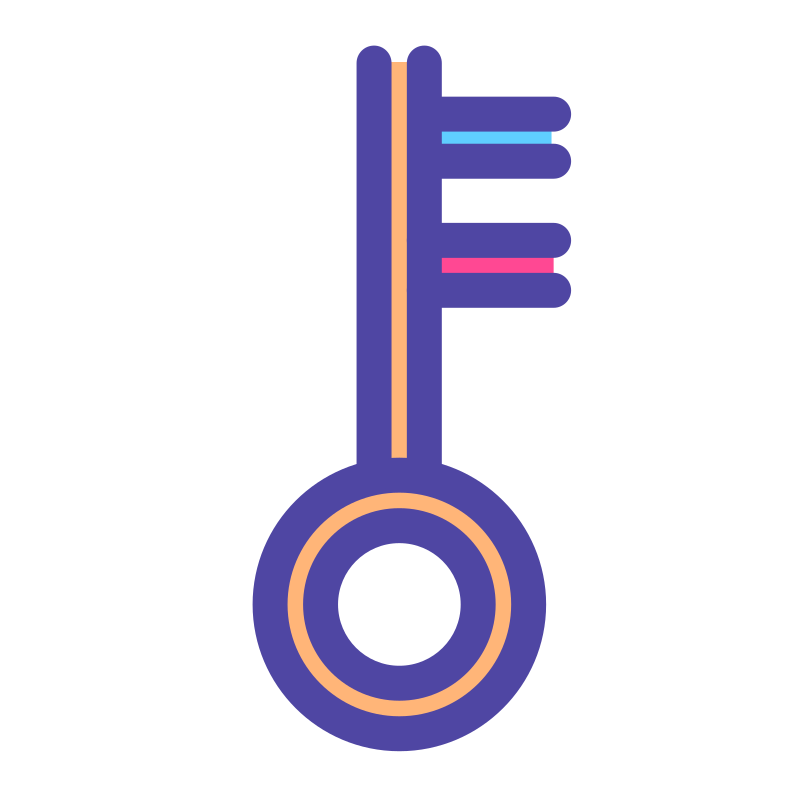
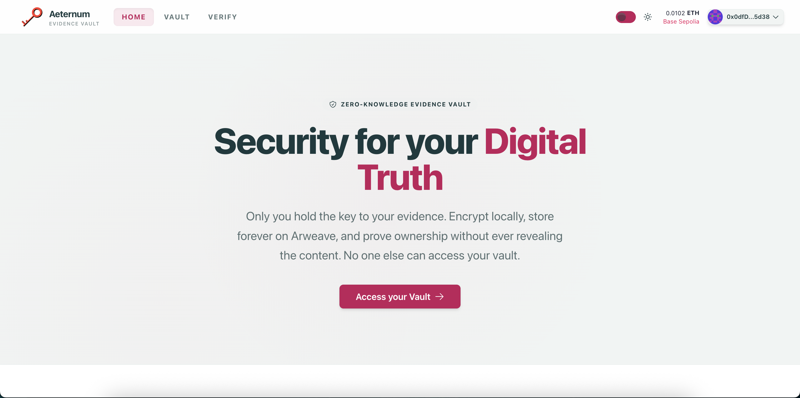
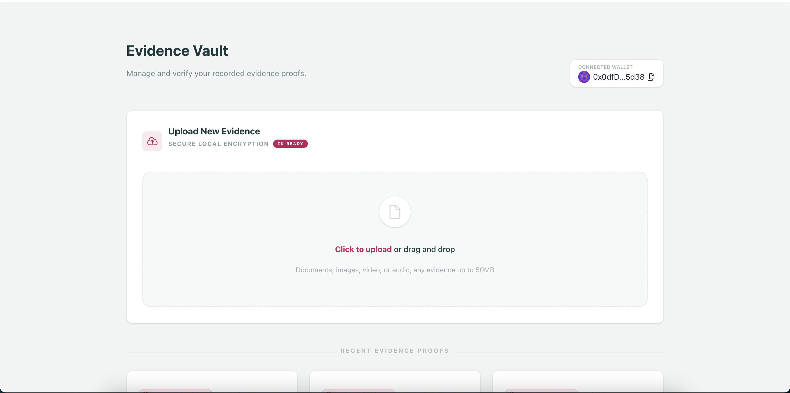
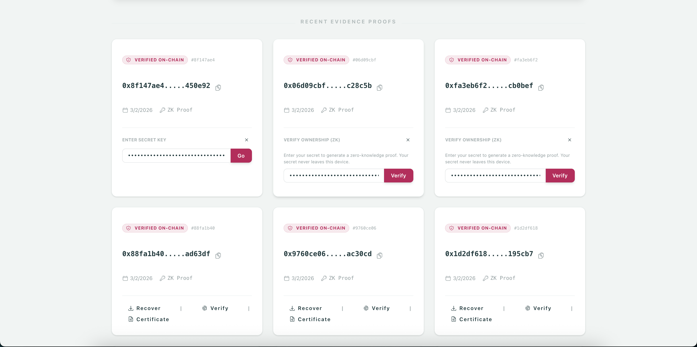
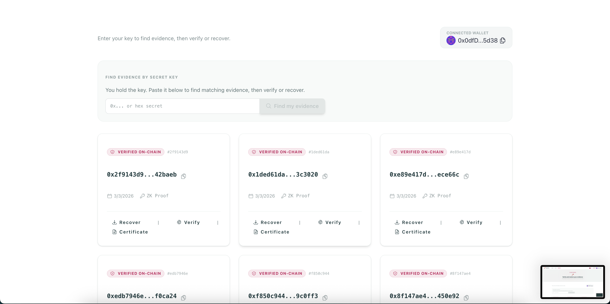
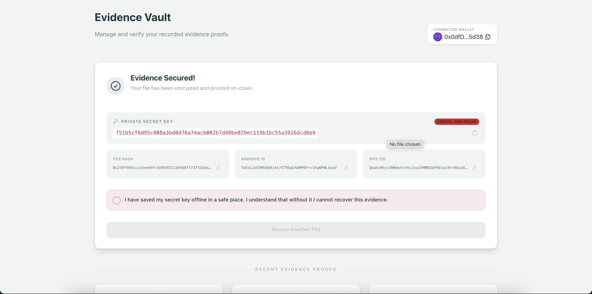
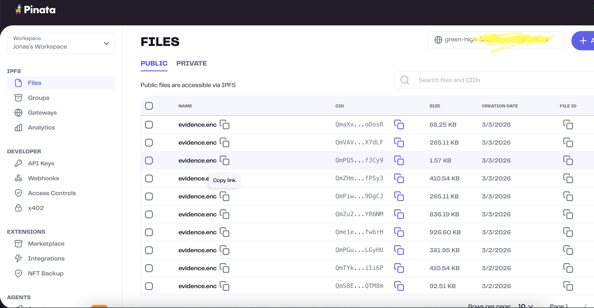

# Aeternum


<div align="center">
  <br/>
  
  
  
  
  
  
  
  
  
  
</div>

<br/>

**Permanent. Private. Verifiable. You hold the key.**

A zero-knowledge, blockchain-timestamped evidence vault. Only you hold the key to your evidence: client-side encrypted, permanently on Arweave (optional IPFS), with Groth16 ZK proofs and immutable records on Base. No one else can access or decrypt your files.

---









## Deployed contracts (Base Sepolia)

Contracts are live on **Base Sepolia** (chainId `84532`). Use the proxy address for the app and integrations.

| Contract | Address |
|----------|---------|
| **EvidenceVault** (proxy) | `0x5e9C84A4A38fe109F4aB4032c05882C6a49Cc654` |
| EvidenceVault (implementation) | `0x9a6B9E407cD918783089FCBE060278A44e4dB292` |
| **CommitmentVerifier** (Groth16) | `0xD203D6F0765200450bFDCFcE87B61dd46dE1FB0d` |
| **Groth16VerifierWrapper** | `0x15c7577d602714769AD54856291A9325b806074d` |

The vault’s ZK verifier is set to the Groth16VerifierWrapper. Indexer (Ponder) runs on Railway for proof list retrieval.

---

## Features

- **You hold the key**: Only you can decrypt and recover your evidence. Client-side AES-256 encryption; your secret never leaves your device.
- **Permanent storage**: Arweave is the primary store, with an optional IPFS backup. Files stored on both Arweave and IPFS are encrypted client side, as illustrated by the IPFS encryption screenshot in , so full privacy is preserved.
- **Verify & recover**: Dedicated verification page where you paste your secret once to find which evidence it unlocks; verify ownership (ZK) or recover files. Keys stay local.
- **Verifiable proofs**: On-chain hash plus ZK commitment on Base; evidence certificate for offline verification.
- **Developer-friendly**: UUPS upgradeable contracts and modular design.

---

## Quick start

```bash
git clone https://github.com/0xJonaseb11/aeternum.git
cd aeternum
yarn install
```

**Frontend**

```bash
cp .env.example .env.local   # set NEXT_PUBLIC_* vars
yarn dev
```

**Contracts & ZK**

```bash
npm run zk:setup    # one-time: circuit + Groth16 setup
yarn compile
yarn test
```

See `packages/hardhat/README.md` for deployment and `packages/nextjs/` for app config.

---

## License
[MIT LICENSE](./LICENCE)

--------------------

(c) 2026 Jonas Sebera

